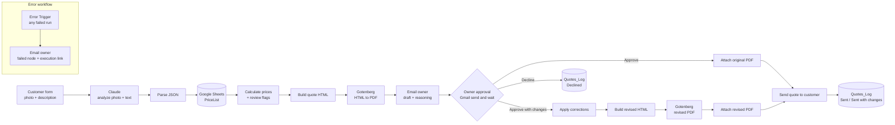

# Summit Roofing – AI Quote Generator

An n8n automation that turns a customer's roof photo and job description into a priced, branded PDF quote. The business owner approves it with one click before anything is sent.

> Summit Roofing is a fictional company used for this demo. The workflow fits any trade business that quotes from a fixed price list.

**Demo video:** coming soon


---

## The problem

Small roofing and trade businesses lose time on quote requests:

- Each request means reading the description, looking at photos, working out quantities, looking up prices and typing a quote document.
- Customers wait days for an answer and often go with whoever replies first.
- Quotes look different every time, and there is no central record of what was sent.

## The solution

The customer fills in a short web form and uploads a roof photo. The workflow then:

1. **Analyzes the job.** Claude reads the description, looks at the photo and lists the work items and quantities.
2. **Prices it from your own price list.** Prices come only from your Google Sheet. The AI never sets a price.
3. **Builds a branded PDF quote.**
4. **Asks the owner for approval by email.** The owner can approve, adjust quantities and add a note, or decline.
5. **Sends the final quote to the customer** and logs it in Google Sheets.

**What the owner gets**

- Quotes ready to review minutes after a request comes in, without typing anything.
- Full control: nothing reaches the customer without the owner's approval.
- A warning when the AI is unsure, so the owner knows which quotes need a closer look.
- A log of every quote, whether it was sent, changed or declined.
- An email alert if anything fails, so no request is lost.

---

## Walkthrough

| | |
|---|---|
| **1. Customer request.** The customer enters name, email, address and job description, and uploads a roof photo.<br><br> | **2. Owner review email.** Total, AI confidence, urgency, the reasoning for each item and any missing info. The draft PDF is attached.<br><br> |
| **3. Approval form.** The owner approves, approves with changes (e.g. `gutter_clean=18, moss_removal=20`) or declines, and can add a note to the customer.<br><br> | **4. Quote sent to the customer.** The revised total and the owner's note are included, with the PDF attached.<br><br> |

**5. Final PDF quote.** Generated from HTML by Gotenberg, using the corrected quantities.


**6. Low-confidence flag.** Here the photo did not show a roof. The subject line is marked *URGENT* and *Needs review*, estimated quantities are labelled, and the missing information is listed.


**7. Error alert.** If any step fails (here, the PDF service was unreachable), the owner gets an email with the failed step and a link to the run.


---

## Key features

- **AI vision with a fixed vocabulary.** Claude may only use the `item_id`s from the price list and must return strict JSON. Prices are never part of the AI output.
- **Pricing in code.** Line totals and the grand total are calculated in a Code node from the Google Sheet. Items not found in the price list are reported to the owner, not priced.
- **Review flags.** A quote is marked *Needs review* when confidence is below 0.6, a quantity is estimated, or an item is unknown. High-urgency jobs get an *URGENT* subject prefix. Estimated quantities are marked with `*` in the PDF.
- **Human in the loop.** The Gmail *send and wait* node collects the owner's decision through a form. It waits up to 7 days.
- **Corrections by the owner.** Corrections use the `item_id=qty` format. `0` removes an item, and any price-list item can be added. Invalid input stops the run and triggers the error alert.
- **Branded PDF.** HTML is rendered to PDF by Gotenberg (headless Chromium). Customer input is HTML-escaped.
- **Logging.** Every outcome is appended to `Quotes_Log` with status `Sent`, `Sent with changes` or `Declined`.
- **Reliability.** The Claude and Gotenberg calls retry on failure. A separate error workflow emails the owner when a run fails.

---

## How it works



## Tech stack

| Component | Role |
|---|---|
| **n8n** (self-hosted) | Workflow engine, customer form, approval form |
| **Claude API** (Anthropic) | Image + text analysis, structured JSON output |
| **Gotenberg 8** | HTML to PDF conversion |
| **Google Sheets** | Price list and quote log |
| **Gmail** | Owner notifications, approval request, customer email |
| **Docker Compose** | Runs n8n and Gotenberg locally |

---

## Setup

**Requirements:** Docker, an Anthropic API key, and a Google account (Sheets and Gmail).

1. **Start the services**
   ```bash
   cp .env.example .env        # optional: change the timezone
   docker compose up -d
   ```
   n8n runs at http://localhost:5678. n8n reaches Gotenberg at `http://gotenberg:3000` inside the Docker network.

2. **Create the Google Sheet** with two tabs, `PriceList` and `Quotes_Log` (see [structure below](#google-sheets-structure)).

3. **Add credentials in n8n** (*Credentials > Add*):
   - Anthropic API
   - Google Sheets OAuth2
   - Gmail OAuth2

4. **Import the workflows** (*Workflows > Import from file*):
   - Import `workflows/error-alert.json` first, then `workflows/ai-quote-generator.json`.

5. **Configure the imported workflows**
   - Assign your credentials to each Claude, Google Sheets and Gmail node.
   - In the three Google Sheets nodes, select your sheet (replacing `YOUR_SHEET_ID`) and the right tab.
   - Replace `owner@example.com` with the owner's address in *Email owner: draft*, *Owner approval* and the error workflow's *Send a message* node.
   - In the quote workflow's *Settings*, set **Error workflow** to *Summit Roofing – Error alert*.

6. **Activate** both workflows and open the production URL of the *On form submission* node to submit a test request.

> **Note:** The approval button in the owner's email links back to your n8n instance. For the owner to use it from another device, n8n must be reachable at a public URL (set `WEBHOOK_URL`), not only `localhost`.

---

## Google Sheets structure

**`PriceList`**: one row per service. `item_id` and `unit` must match the values in the Claude prompt.

| item_id | description | unit | price_eur |
|---|---|---|---|
| gutter_clean | Gutter cleaning | m | 6 |
| tile_repair | Tile repair (single tiles) | piece | 12 |
| moss_removal | Moss removal and roof cleaning | m2 | 8 |
| inspection | On-site inspection | job | 90 |
| leak_fix | Leak detection and repair | job | 280 |
| … | | | |

All supported `item_id`s and their units:
`tile_replace` (m2), `tile_repair` (piece), `gutter_replace` (m), `gutter_clean` (m), `flashing_repair` (m), `ridge_repair` (m), `leak_fix` (job), `insulation` (m2), `skylight_install` (piece), `scaffolding` (job), `inspection` (job), `disposal` (job), `moss_removal` (m2).

**`Quotes_Log`**: the workflow appends one row per outcome.

| date | customer_name | email | job_summary | total_eur | status |
|---|---|---|---|---|---|
| 2026-10-05 15:13 | Sarah Mitchell | customer@example.com | Gutter cleaning and cracked tile repair | 340 | Sent with changes |

---

## Repository structure

```
.
├── workflows/
│   ├── ai-quote-generator.json   # main workflow (18 nodes)
│   └── error-alert.json          # error workflow
├── screenshots/                  # README images, in walkthrough order
├── docker-compose.yml            # n8n + Gotenberg
├── .env.example
└── README.md
```

## Notes and limitations

- Quotes are **estimates**. The PDF states that the final price is confirmed after an on-site inspection.
- The AI's quantities depend on photo quality and on how detailed the description is. The review flags exist for exactly this reason, and the owner's approval is always required.
- Credential IDs, the Google Sheet ID and personal email addresses have been removed from the exported workflows.
